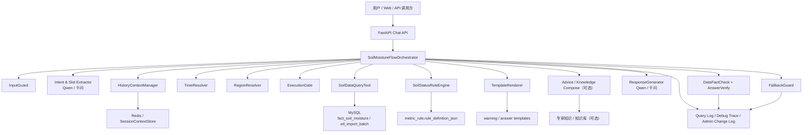
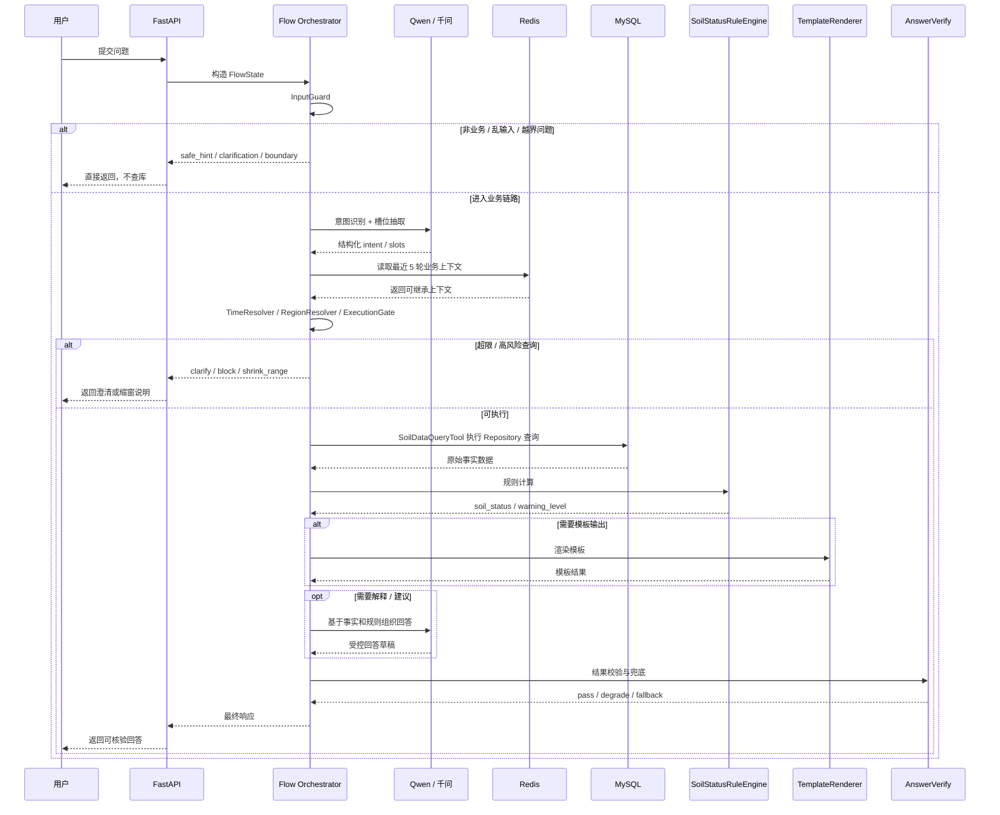
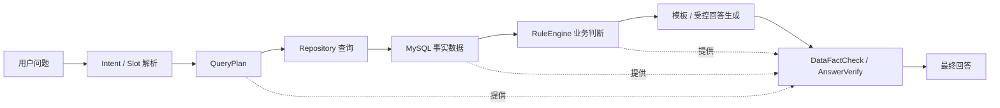
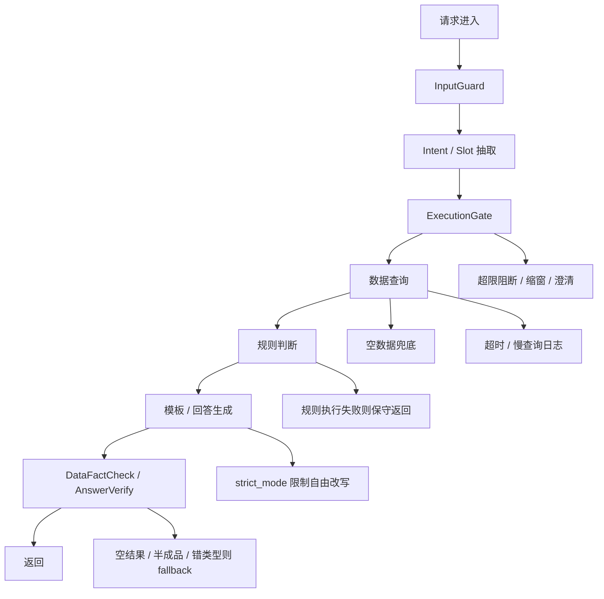
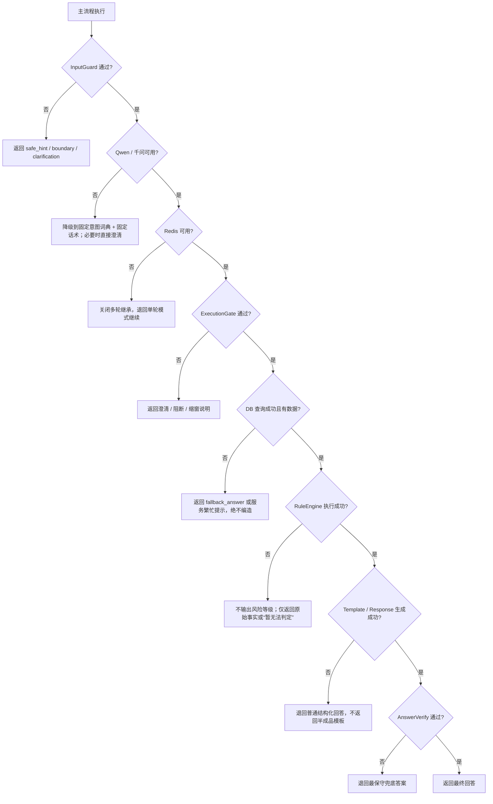

# 7. 墒情 Agent 系统设计图（受限 Flow、轻量可靠性与失败降级版）

> 本文档基于 `1~6` 号方案整理成“可对齐研发、测试、运维、产品”的系统设计图版本。  
> 这份文档刻意采用**轻量项目口径**：不引入数据血缘、规则版本治理、数据新鲜度治理、数据整治等重型机制；重点放在**主流程是否稳、降级是否硬、代码失败时怎么安全收口**。

---

## 1. 文档目标

本设计图文档主要回答 5 个问题：

- 系统整体由哪些模块组成
- 一次用户请求在系统里如何流转
- 功能实现的可靠性靠什么保证
- 轻量事实边界靠什么保证
- 为什么当前实现采用受限 Flow，而不是 LangGraph

一句话结论：

> 这是一个“**LLM 受控参与、数据库提供事实、规则引擎提供业务判断、模板提供输出约束、Flow 控制路径、失败路径明确降级**”的单 Agent 系统。

---

## 2. 总体设计原则

### 2.1 三条硬原则

#### 原则 1：事实尽量来自结构化数据

- 监测值、地区、设备、时间，主要可信来源是 `MySQL / fact_soil_moisture`
- LLM 不得生成、补齐、推断监测数字
- 查不到就明确说“暂无数据”或“当前无法判断”，不硬编结果

#### 原则 2：业务状态主要来自规则引擎

- “重旱 / 涝渍 / 设备故障 / 未达到预警条件”必须由 `SoilStatusRuleEngine` 判定
- 不允许 LLM 根据话术或常识自行判断风险等级
- 当前规则固定即可，不强制引入版本治理

#### 原则 3：模板输出必须受控且可回退

- 预警正文核心结构来自模板，不允许 LLM 随意改写核心字段
- 如果触发 `strict_mode`，模板正文只允许填槽，不允许自由发挥
- 模板渲染失败时，必须能退回普通结构化回答，不能把半成品模板直接返回给用户

---

## 3. 总体架构图

### 3.1 模块职责说明

- `FastAPI Chat API`：统一接收请求、返回响应、注入 `request_id / session_id / trace_id`
- `SoilMoistureFlowOrchestrator`：只负责编排，不直接承担业务事实判断
- `Qwen / 千问`：只用于意图识别、槽位抽取、受控自然语言组织
- `MySQL`：提供监测事实和批次事实，是回答中数字与时间的权威来源
- `RuleEngine`：提供“业务状态真相”，负责把监测值映射成业务判断
- `TemplateRenderer`：负责把规则结果渲染成固定格式输出
- `Advice / Knowledge Compose`：只用于解释、建议、背景补充，不覆盖结构化事实
- `DataFactCheck + AnswerVerify`：负责做结果兜底，防止空回答、错路由、半成品模板直接暴露

---

## 4. 请求主链路时序图

---

## 5. 轻量事实边界图

### 5.1 轻量事实边界

回答里最关键的内容，应尽量来自这些来源：

- 时间范围：来自 `TimeResolver`
- 地区 / 设备：来自 `RegionResolver + region_alias 静态映射 + 结构化维表映射`
- 监测值：来自 `fact_soil_moisture`
- 状态 / 预警等级：来自 `SoilStatusRuleEngine`

### 5.2 轻量红线

以下行为必须禁止：

- 没查到数据却回答“正常”
- 没命中规则却回答“已触发预警”
- 用户问“最近”，系统却按服务器当前时间硬算
- 指定地区不存在时，系统擅自替换成相似地区
- 未经过 `region_alias` 映射或唯一高置信轻度模糊校验，就把简称/错字直接改写成别的地区
- 使用知识库内容覆盖数据库事实
- 使用模型生成数字、设备号、地区名、监测时间

---

## 6. 功能可靠性保护图

### 6.1 可靠性最关键的 8 个保护点

- `InputGuard`：挡住乱输入、闲聊、越界请求，防止误查库
- `HistoryContextManager`：只继承白名单槽位，避免多轮串题
- `ExecutionGate`：限制时间窗、TopN、批量趋势等高风险查询
- `Flow route validation`：启动时校验所有 `next_action` 与路由表，防止漏配
- `Repository`：统一数据库访问入口，避免查询逻辑散落在各节点
- `RuleEngine`：统一业务口径，避免每个回答各算各的
- `Template strict_mode`：保证预警文本核心内容不被模型改坏
- `DataFactCheck / AnswerVerify`：拦住空回答、半模板、错 `answer_type`
- `Redis SessionContextStore`：上下文失败时可退回单轮，不拖垮主查询

---

## 7. 更硬的降级策略图

### 7.1 降级原则

- 模型不可用时，**系统可以变笨，但不能变假**
- 上下文不可用时，**系统可以丢失多轮能力，但不能串题**
- 数据不足或查库失败时，**系统可以不回答结论，但不能编结论**
- 规则执行失败时，**系统可以只给事实，不给风险判断**
- 模板渲染失败时，**系统可以退回普通回答，但不能把坏模板发出去**
- 任何未知异常时，**系统都应返回安全错误，不返回堆栈或脏内容**

### 7.2 建议采用的硬降级顺序

1. **继续执行但降能力**：如 Redis 不可用，退回单轮模式
2. **继续执行但降格式**：如模板失败，退回普通结构化文本
3. **继续执行但降结论**：如规则失败，只返回事实，不返回风险判断
4. **终止执行并澄清**：如意图不明、参数不足、门禁不通过
5. **终止执行并安全报错**：如 DB 连不上、关键节点异常、响应对象损坏

---

## 8.1 Flow 安全契约说明

工程落地时，还必须同时遵守：

- 路由完整性契约
- 状态写入白名单契约
- 循环与重试上限契约
- 上下文并发安全契约
- 知识边界安全契约

详细约束见：`8.2026-04-21-soil-moisture-agent-flow-risk-contract.md`

---

## 8. 为什么当前实现不是 LangGraph

### 8.1 当前判断

当前系统更适合：

- 固定步骤
- 显式条件分支
- 强约束状态结构
- 可验证失败路径

而不是：

- 自由规划
- 多轮工具自发调用
- 高动态回路编排

### 8.2 未来什么时候再评估 LangGraph

只有在这些情况同时明显出现时，再考虑：

- 一个请求里要动态调用很多工具
- 工具之间顺序不固定
- 要有复杂回路、多次反思、多步规划
- 需要多个 Agent 分工协作
- 自研 Flow 已经明显难维护

结论：

- **当前实现：受限 Flow**
- **未来升级：保留 LangGraph / 多 Agent 评估入口，但不预先绑定**
