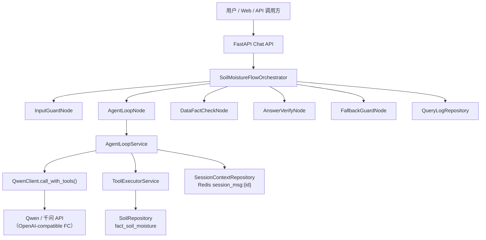
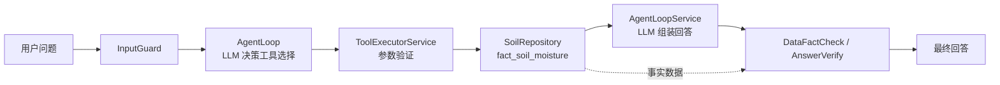
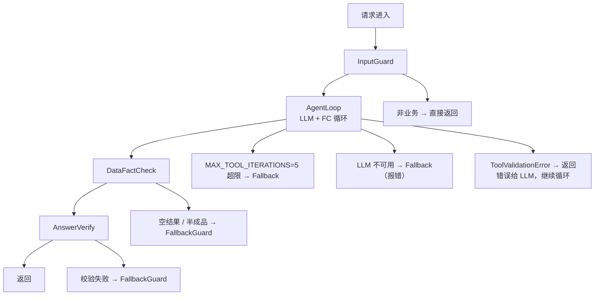
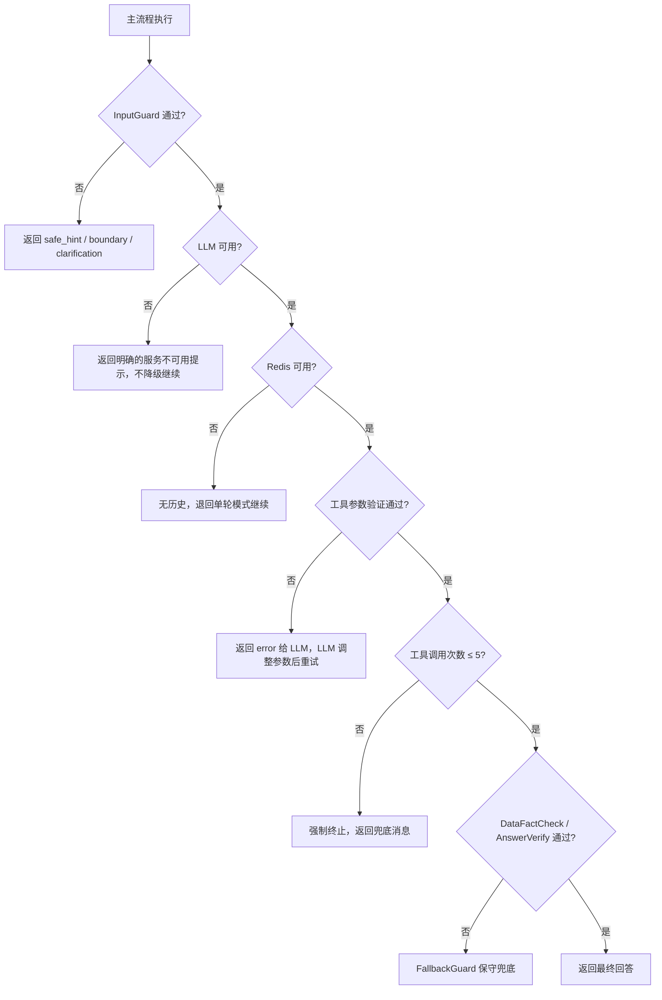

# 7. 墒情 Agent 系统设计图（LLM + Function Calling 版）

> 本文档描述当前 LLM + Function Calling 架构下的系统组成与流转，以仓库中的正式实现为准。

---

## 1. 文档目标

本设计图文档主要回答 5 个问题：

- 系统整体由哪些模块组成
- 一次用户请求在系统里如何流转
- 功能实现的可靠性靠什么保证
- 事实边界靠什么保证
- 为什么选择 LLM + Function Calling 而不是 LangGraph

一句话结论：

> 这是一个"**LLM 作为决策者、ToolExecutor 作为守门员、消息历史驱动多轮理解、5 节点 Flow 控制路径**"的单 Agent 系统。

---

## 2. 总体设计原则

### 2.1 三条硬原则

#### 原则 1：事实来自结构化数据，不来自 LLM

- 监测值、地区、设备、时间，可信来源是 `MySQL / fact_soil_moisture`
- LLM 不得生成、补齐、推断监测数字
- 查不到就明确说"暂无数据"，不硬编结果

#### 原则 2：工具参数由代码验证，不由 LLM 自证

- 所有工具参数经过 `ToolExecutorService` 验证后才执行 SQL
- 超范围参数（top_n > 20、时间跨度过大）返回错误给 LLM，让 LLM 调整
- LLM 不能直接操作数据库

#### 原则 3：多轮上下文来自真实消息历史

- Redis 存储 OpenAI messages 格式的完整对话历史
- LLM 从 messages 中天然理解"那里"、"那个设备"等指代
- 无需手动提取槽位继承，无串题风险

---

## 3. 总体架构图



### 3.1 模块职责说明

- `FastAPI Chat API`：统一接收请求、返回响应
- `SoilMoistureFlowOrchestrator`：5 节点 Flow 编排，不直接处理业务
- `AgentLoopService`：LLM ↔ 工具调用循环，最多 5 次工具调用
- `QwenClient`：封装 Qwen API，支持 Function Calling（`call_with_tools()`）
- `ToolExecutorService`：唯一工具执行层，验证参数后调用 SoilRepository
- `SessionContextRepository`：OpenAI messages 格式对话历史（Redis）
- `SoilRepository`：只读 `fact_soil_moisture`，提供事实数据
- `RegionAliasResolver`：地区名称解析，查 `region_alias`（city/county 两级），加 `fact_soil_moisture` 存在性校验，即 `RegionAliasResolver + region_alias(city/county) + fact_soil_moisture 存在性校验`
- `DataFactCheckNode`：事实核查，防止空回答和内部术语外泄
- `AnswerVerifyNode`：最终回答合规校验

---

## 4. 请求主链路时序图

```mermaid
sequenceDiagram
    participant U as 用户
    participant API as FastAPI
    participant FLOW as Flow Orchestrator
    participant GUARD as InputGuard
    participant LOOP as AgentLoopService
    participant QWEN as Qwen API
    participant EXEC as ToolExecutorService
    participant DB as MySQL
    participant REDIS as Redis

    U->>API: 提交问题
    API->>FLOW: 构造 FlowState
    FLOW->>GUARD: InputGuard 检查

    alt 非业务 / 越界 / 结束语
        GUARD-->>API: safe_hint / clarification / closing
        API-->>U: 直接返回，不查库
    else 进入业务链路
        GUARD->>LOOP: continue → AgentLoop
        LOOP->>REDIS: load_history(session_id)
        REDIS-->>LOOP: 最近对话消息列表

        loop LLM ↔ 工具调用（最多 5 次）
            LOOP->>QWEN: call_with_tools(messages, SOIL_TOOLS)
            alt LLM 返回 tool_call
                QWEN-->>LOOP: {type: tool_call, tool_name, tool_args}
                LOOP->>EXEC: execute(tool_name, tool_args)
                EXEC->>DB: filter_records_async(...)
                DB-->>EXEC: 查询结果
                EXEC-->>LOOP: {records: [...]}
                LOOP->>LOOP: 追加 tool 结果到 messages
            else LLM 返回 text
                QWEN-->>LOOP: {type: text, content}
                LOOP->>REDIS: save_message_turn(session_id, ...)
                LOOP-->>FLOW: AgentLoopResult(final_answer)
            end
        end

        FLOW->>FLOW: DataFactCheck → AnswerVerify
        FLOW-->>API: 最终响应
        API-->>U: 返回可核验回答
    end
```

---

## 5. 事实边界图



### 5.1 事实红线

以下行为必须禁止：

- LLM 编造数字、地区名称、设备编号、监测时间
- 工具参数未经 ToolExecutorService 验证就执行 SQL
- 没查到数据却回答"正常"或"已触发预警"
- 使用 LLM 知识库内容覆盖数据库事实

---

## 6. 可靠性保护图



### 6.1 关键保护点

- `InputGuard`：挡住乱输入、闲聊、越界请求
- `ToolExecutorService`：唯一工具执行层，防止 LLM 幻觉参数进入 SQL
- `MAX_TOOL_ITERATIONS=5`：防止 LLM 工具调用死循环
- `SessionContextRepository`：Redis 不可用时退回单轮（无历史），不拖垮主查询
- `DataFactCheck / AnswerVerify`：拦住空回答、半成品、内部术语外泄

---

## 7. 降级策略图



### 7.1 降级原则

- LLM 不可用时，**必须明确报错，不能假装正常**（与旧架构不同：旧架构可退回正则）
- 上下文不可用时，**系统可以丢失多轮能力，但不能串题**
- 工具参数非法时，**返回错误给 LLM，让 LLM 自行调整**
- 工具调用超上限时，**强制终止并降级**
- 数据库不可用时，**HTTP 503，不伪造数据**

---

## 8. 为什么是 Function Calling 而不是 LangGraph

### 8.1 当前判断

当前系统适合：

- 收口后的固定工具集（4 类真实能力）
- LLM 作为唯一意图理解和工具路由决策者
- 强约束参数验证边界
- 可验证的失败路径

不需要：

- 多 Agent 分工协作
- 高动态回路编排
- 复杂多步规划

### 8.2 未来什么时候评估 LangGraph

只有在这些情况同时明显出现时，再考虑：

- 一个请求里要动态调用很多工具（>10 个）
- 工具之间顺序不固定且有复杂依赖
- 需要多个 Agent 协作分工
- 自研 AgentLoopService 已明显难维护

结论：

- **当前实现：LLM + Function Calling + 5 节点受限 Flow**
- **未来升级：保留 LangGraph / 多 Agent 评估入口，但不预先绑定**
