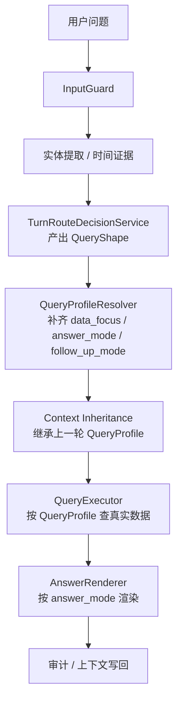

# 9. Deterministic 查询治理与 `QueryProfile` 收口实现

> 本文档记录 deterministic `/chat-v2` 查询链路当前已经落地的 `QueryProfile` 治理方式，以及后续新增问法时应该优先补哪一层，避免重新退回“逐句补词”的维护路径。

## 1. 问题本质

最近出现的很多问题，表面上各不相同：

- `3月20号全省出现墒情预警信息的点位是哪些`
- `2月1号全省出现墒情预警信息的点位有多少个`
- `2月1号呢`
- `徐州呢`
- `这些地方呢`

看上去像不同 Case，实际上大多不是“缺一个词”的问题，而是**同一轮查询的几个关键维度没有被统一建模**，导致：

- 路由层猜一遍
- 查询层猜一遍
- 多轮继承再猜一遍
- 文案层再猜一遍

只要四层里有一层理解偏了，最后就会表现成：

- 能查到数据，但答错类型
- 第二轮能继承时间，但继承不了“到底在查什么”
- 同样一句“有多少个”，有时返回概况，有时返回列表，有时直接澄清

所以，**真正的问题不是 Case 太少，而是内部契约还不够统一**。

## 2. 当前实现为什么能避免“继续打补丁”

当前 deterministic `/chat-v2` 链路已经比最早版本收敛很多，尤其是：

- 顶层路由已经中心化到 `TurnRouteDecisionService`
- 时间窗已经统一到 `start_time/end_time`
- 多轮上下文已经统一到 `query_state + time_window + resolved_entities + query_profile`
- `QueryProfileResolverService` 已经把 `data_focus / answer_mode / result_grain / measure / compare_mode / group_by / list_target` 收到一份内部真相
- `WarningPredicateService` 已经作为共享预警判定入口接入 `summary / list / group / count / compare` 执行链路

如果这些维度重新散回到多个末端分支里，就会重新出现下面这些典型问题：

| 用户问法 | 真正想要的能力 | 容易错到哪里 |
|---|---|---|
| `点位是哪些` | 用真实数据集列设备 | 被落到 summary |
| `点位有多少个` | 用同一数据集做 count | 被落到 summary，或沿用列表文案 |
| `2月1号呢` | 继承上一轮查询画像，只覆盖时间 | 只继承时间，不继承“预警点位数量”这个语义 |
| `徐州呢` | 继承上一轮查询画像，只覆盖对象 | 被当成全新概况句，或继承成错误对象 |

换句话说，当前系统已经不是“只有中心路由”，而是“中心路由 + 中心查询画像”两层收口；后续新增能力要优先复用这两层，而不是在 handler 里重写一遍判断。

## 3. 当前内部真相

deterministic 查询链路当前的治理目标已经固定为：不继续给某个分支补关键词，而是把每轮业务问题统一收口到一个内部对象。

## 3.1 唯一内部真相：`QueryProfile`

每一轮业务问题，在进入真正查询执行前，都必须先被收成一个稳定的 `QueryProfile`。

当前目标结构如下：

```json
{
  "subject": "soil",
  "data_scope": "global",
  "data_focus": "warning_only",
  "result_grain": "device_list",
  "answer_mode": "count",
  "time_window": {
    "start_time": "2026-02-01 00:00:00",
    "end_time": "2026-02-01 23:59:59"
  },
  "slots": {
    "province": "江苏省",
    "city": null,
    "county": null,
    "sn": null
  },
  "follow_up_mode": "standalone"
}
```

## 3.2 字段含义

| 字段 | 作用 | 示例 |
|---|---|---|
| `subject` | 当前在问哪类能力 | `soil / warning_rule / warning_template` |
| `data_scope` | 当前对象范围 | `global / province / city / county / sn` |
| `data_focus` | 当前数据集是全量原始墒情，还是只看满足预警条件的子集 | `all_records / warning_only` |
| `result_grain` | 查询结果按什么粒度组织 | `summary / device_list / record_list / region_group / detail` |
| `answer_mode` | 用户最终要什么形式的答案 | `summary / count / list / detail / template` |
| `time_window` | 唯一执行时间真相 | `start_time / end_time` |
| `slots` | 当前显式或继承后的对象槽位 | `province / city / county / sn` |
| `follow_up_mode` | 这轮是独立句、继承句、重置句还是澄清句 | `standalone / inherit / reset / clarify` |

## 4. `QueryShape` 和 `QueryProfile` 的关系

当前已经存在的 `QueryShape` 不需要推翻，它仍然有价值，但职责要更清楚：

- `QueryShape`：负责**顶层分类**
  - `subject`
  - `action`
  - `grain`
  - `mode`
- `QueryProfile`：负责**真正执行契约**
  - 在 `QueryShape` 基础上补全
  - `data_focus`
  - `answer_mode`
  - `time_window`
  - `slots`
  - `follow_up_mode`

当前实际分工是：

```text
用户输入
  -> InputGuard
  -> Entity / Time Evidence
  -> QueryShape（顶层分类）
  -> QueryProfileResolver（补齐执行画像）
  -> QueryExecutor（按画像查数据）
  -> AnswerRenderer（按画像渲染）
```

这层分工已经体现在代码里，关键约束是：

- `TurnRouteDecisionService` 不再同时承担“顶层分类 + 结果形态猜测 + 部分 follow-up 语义还原”
- `DataAnswerService` 不再一边查数据，一边继续猜“这轮到底想要 summary 还是 count”

## 5. 通用处理原则

后续所有 deterministic 查询问题，统一按下面 5 条原则治理。

## 5.1 同一批数据，不同答案形态必须解耦

例如：

- `3月20号全省出现墒情预警信息的点位是哪些`
- `3月20号全省出现墒情预警信息的点位有多少个`

它们本质上应该共享同一批数据：

- `subject=soil`
- `data_focus=warning_only`
- `result_grain=device_list`
- `time_window=2026-03-20`

唯一差别只是：

- 前者 `answer_mode=list`
- 后者 `answer_mode=count`

所以不能：

- 前者走 list 查询
- 后者重新掉回 summary 查询

正确做法是：**先确定数据集，再决定回答形态。**

## 5.2 多轮继承继承的是“查询画像”，不是零散槽位

例如：

- 第一轮：`2月6号全省出现墒情预警信息的点位有多少个`
- 第二轮：`2月1号呢`

第二轮正确继承的不是简单的“全省 + 时间”，而是上一轮整个画像：

- `subject=soil`
- `data_scope=global`
- `data_focus=warning_only`
- `result_grain=device_list`
- `answer_mode=count`

第二轮只覆盖：

- `time_window`

如果系统只继承地区和时间，不继承 `data_focus` / `answer_mode`，就会退化成“整体墒情概况”。

## 5.3 显式新对象优先覆盖，未提到的维度才继承

例如：

- 第一轮：`南京最近30天异常概况`
- 第二轮：`徐州呢`

第二轮应当：

- 继承：`data_focus=warning_only`、`result_grain=summary`、`answer_mode=summary`、原时间窗
- 覆盖：`city=徐州`

而不是：

- 直接重置成普通 summary
- 或者继承成“南京徐州混合对象”

## 5.4 结果渲染只认 `answer_mode`

渲染层不应该再猜：

- 这是概况吗
- 这是数量吗
- 这是详情吗

而应该只看统一契约：

- `answer_mode=summary` -> 概况文案 + `summary_card`
- `answer_mode=count` -> 数量文案 + `evidence_only list_table`
- `answer_mode=list` -> 列表文案 + `list_table`
- `answer_mode=detail` -> 详情文案 + `detail_card`
- `answer_mode=template` -> 模板渲染

这样前后端和 BFF 才不会再出现“后端查的是列表，前端展示成概况解释”的漂移。

## 5.5 真正的补丁和结构化修复要区分

不是所有规则都是坏事。规则式系统本来就需要规则。

关键在于规则加在哪一层：

| 类型 | 是否合理 | 例子 |
|---|---|---|
| 结构化规则 | 合理 | `点位有多少个 -> answer_mode=count` |
| 数据集规则 | 合理 | `预警信息 -> data_focus=warning_only` |
| 继承规则 | 合理 | `时间追问 -> 继承上一轮 QueryProfile，仅覆盖时间` |
| 分支补丁 | 不理想 | 在多个 handler 里重复判断“如果 message 里有多少个就改文案” |
| 文案补丁 | 不理想 | 查询仍走 summary，只把文字硬改成“共有 X 个点位” |

所以判断“是不是在打补丁”的标准不是“有没有规则”，而是：

> **这条规则是在统一契约层，还是散落在多个末端分支里。**

## 6. 推荐主流程



## 7. 多轮边界的统一规则

后续多轮判断建议统一成下面这张表，而不是分散在不同服务里各自猜测。

| 场景 | 处理方式 |
|---|---|
| 当前轮给了完整新对象、新时间、新动作 | `reset` |
| 当前轮只换对象，如 `徐州呢` | 继承上一轮 `QueryProfile`，仅覆盖对象 |
| 当前轮只换时间，如 `2月1号呢` | 继承上一轮 `QueryProfile`，仅覆盖时间 |
| 当前轮只换输出形式，如 `有多少个`、`详情呢` | 继承上一轮数据集，仅覆盖 `answer_mode` |
| 当前轮没有明确业务信息，只有模糊指代 | `clarify` |
| 当前轮是纯结束语 | `closing_end + clear_context` |

这张表的核心是：

> 多轮判断不是“这句话像不像追问”，而是“这句话相对上一轮改了画像的哪几个维度”。

## 8. 落地改造顺序

如果继续演进 deterministic 查询链路，建议按下面顺序做，而不是继续零散修。

### 阶段 1：补齐内部契约

- 在 `query_state` 中补齐：
  - `data_focus`
  - `answer_mode`
  - `follow_up_mode`
- 让 `TurnRouteDecisionService` 或其下游 resolver 明确产出这些字段

### 阶段 2：执行层只认画像

- 查询执行时先看 `QueryProfile`
- `warning_only` 必须先筛预警记录，再做：
  - count
  - list
  - group
  - detail

### 阶段 3：渲染层只认 `answer_mode`

- count 不再回退成 summary 文案
- list / detail / summary / template 输出规则全部固定

### 阶段 4：多轮继承只继承 QueryProfile

- 时间追问
- 对象追问
- 输出形态切换

统一按“继承画像 + 覆盖显式新维度”处理。

### 阶段 5：测试体系双层化

- 正式 Case：继续保留稳定业务验收库
- 快速矩阵：覆盖问法变体、数量/列表/详情边界、多轮继承边界

这样 Case 就不再是“堆题库”，而是“验证统一契约是否稳定”。

## 9. 对当前项目的结论

当前方向并没有错，问题也不是“规则式路线走不通”。

真正的问题是：

- 顶层路由已经开始收口
- 但查询画像还没有彻底收口

所以才会出现一种观感：

> 每次都像在修一个具体句子，但修完后又在相邻问法上出新问题。

后续只要把 deterministic 查询链路继续往 `QueryProfile` 统一契约上收，很多问题会从“补词”变成“补画像维度”，维护成本会明显下降。

## 10. 一句话结论

这类问题的通用解法不是“继续补 Case”，而是：

> **把每轮业务问题统一收成 `QueryProfile`，让路由、执行、多轮继承、渲染都只认这一份内部真相。**
