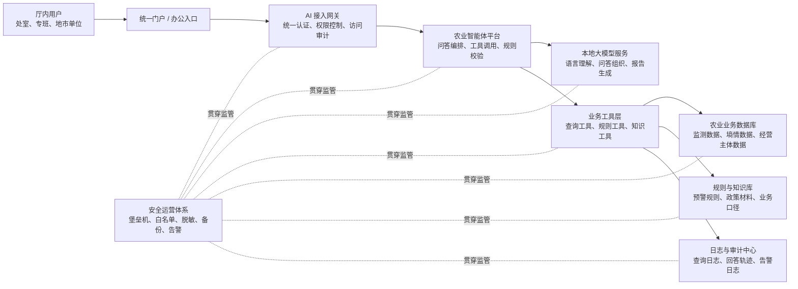

# 省厅农业大模型与智能体本地部署系统架构图

这份材料用于补齐“怎么部署、部署在哪里、如何控风险、如何保真实性”的图示说明。

## 一、架构设计原则

面向省厅场景，推荐采用以下四条原则：

- **数据不出厅**：核心业务数据、日志数据、规则数据原则上留在厅内专有环境
- **模型不裸奔**：大模型不直接面对底层数据库，而是通过智能体和白名单工具访问数据
- **业务回答必须有依据**：所有关键业务结论都应先查真实数据，再经校验后返回
- **全过程可追溯**：用户问题、工具调用、查询结果、最终回答都可留痕审计

---

## 二、推荐部署架构图（领导版）

## 三、这张图怎么讲

可以用下面这段话解释：

> 整体上分成五层。第一层是厅内用户入口；第二层是统一接入和权限控制；第三层是农业智能体平台；第四层是本地大模型和业务工具层；第五层是农业业务数据库、规则知识库和审计中心。  
> 这里最重要的一点是，大模型不直接访问底层数据，而是通过智能体调用受控工具获取必要数据，再进行语言组织和结果生成。这样既能发挥 AI 能力，又能把数据安全和真实性控制在体系内。

---

## 四、推荐部署位置

### 推荐方案一：厅级政务云专有区

适合大多数厅级单位，优点是：

- 扩容方便
- 运维体系成熟
- 便于统一纳管
- 适合多场景逐步扩展

### 推荐方案二：厅级数据中心机房

适合高敏感场景，优点是：

- 物理隔离更强
- 对核心数据掌控更直接

### 建议结论

**优先采用“政务云专有区为主，核心数据区和审计区高标准隔离”的部署方式。**

---

## 五、推荐逻辑分区

建议至少划分 6 个区：

- **访问区**：门户、PC 端、移动端、办公入口
- **接入区**：API 网关、统一认证、访问控制
- **应用区**：智能体服务、场景应用、报表服务
- **模型服务区**：本地推理集群、模型调度服务
- **数据区**：数据库、规则库、知识库、向量库
- **安全审计区**：日志中心、审计中心、备份中心、告警中心

这样的好处是：

- 业务访问路径清晰
- 数据边界清楚
- 便于权限分层和风险隔离

---

## 六、数据真实性保障链路

下面这张图专门回答“为什么它说的话可信”。

## 七、这条链路的核心价值

这条链路和普通聊天机器人的最大不同是：

- **业务问题不能绕过工具直接作答**
- **没有查到真实数据，就不能给确定性业务结论**
- **回答前还有事实校验，不是模型想怎么说就怎么说**
- **事后还能追溯“依据什么回答”**

这套机制特别适合省厅场景，因为领导关心的不是“它会不会说”，而是“它说的是不是真的、出了问题能不能追责”。

---

## 八、结合当前项目的落地映射

当前 Smart Agriculture MVP 已经具备下面这套基础架构：

- `web`：统一入口和前端交互
- `agent`：农业智能体服务
- `mysql`：农业事实数据、规则、模板、日志
- `redis`：短时上下文和运行态缓存

对应关系可以理解为：

- `web` 对应访问区和部分接入区
- `agent` 对应应用区的农业智能体平台
- 本地大模型服务后续可以作为独立模型服务区部署
- `mysql`、规则库、日志库对应数据区和审计区

也就是说，当前项目已经具备继续演进为“厅级本地部署样板”的基础，只需要在算力、网络、安全和审计侧进一步增强。

---

## 九、给领导汇报时建议这样解释

> 这套系统不是把一个聊天模型单独部署进机房，而是把“模型能力、业务数据、规则机制、安全防控和审计追溯”整合成一套闭环。  
> 对省厅来说，真正可用的不是一个会聊天的模型，而是一个能在厅内安全运行、能查真数据、能按规则回答、能全过程留痕的农业智能体体系。
